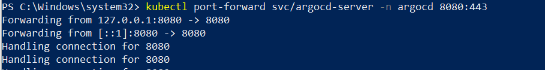
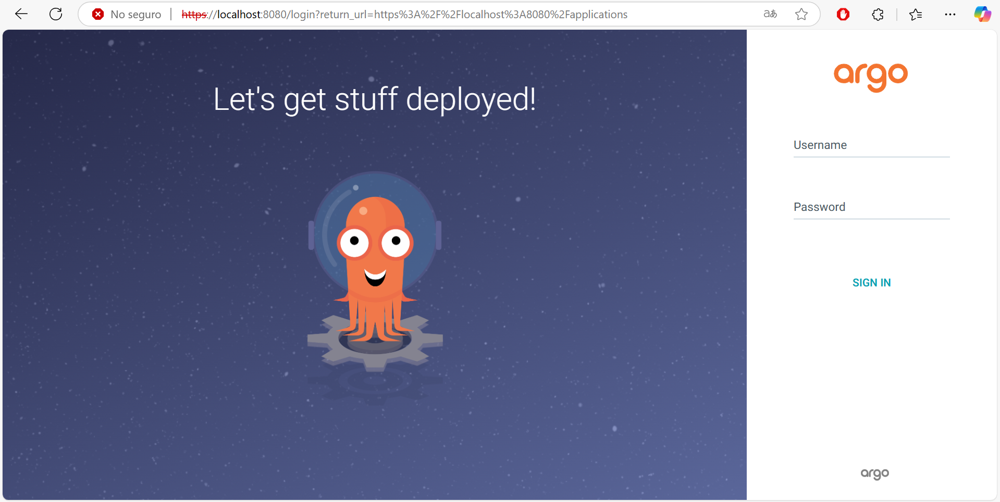
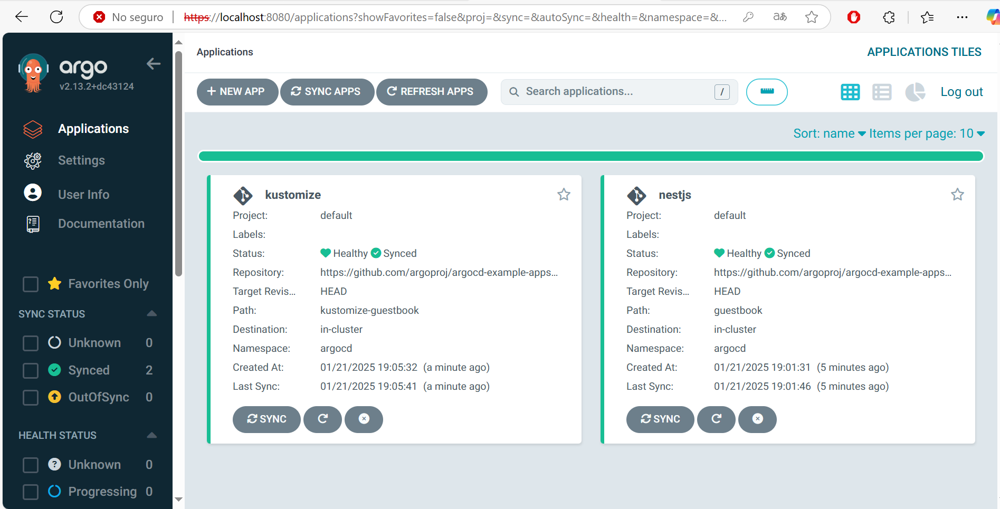

# Desafio 10

En este desafio, se crea una guía de instalación y configuración de ArgoCD para un ambiente local (minikube) en la cual se especificara los pasos para realizarlo, adicionando la instalacion de componentes como Kubectl, Kubens y el propio Minikube. Una vez instalado ArgoCD se detallara como exponerlo a la web, obtener sus credenciales para acceder a la aplicacion y como realizar la carga de las aplicaciones las cuales seran gestionadas por ArgoCD.

## 1. Instalación de Prerrequisitos
Antes de iniciar con la instalación de ArgoCD, asegurémonos de contar con las herramientas necesarias.

### Instalar kubectl
Descarga kubectl correspondiente a tu versión de Kubernetes desde su página oficial.
https://kubernetes.io/docs/tasks/tools/

Una vez instalado, se puede verificar la instalación:

```bash
kubectl version --client --output=yaml
```

### Instalar Minikube
Descarga e instala Minikube desde su página oficial.
https://minikube.sigs.k8s.io/docs/start/?arch=%2Fwindows%2Fx86-64%2Fstable%2F.exe+download

Para verificar si se descargo e instalo correctamente, se puede utilizar el siguiente comando para ver la version de minikube instalado.

```bash
minikube version
```

Una vez instalado, se debe iniciar el clúster local:

```bash
minikube start
```

---

## 2. Instalación de ArgoCD
ArgoCD se instala en un namespace dedicado dentro de Kubernetes.

- **Paso 1**: Crear el namespace para ArgoCD

```bash
kubectl create namespace argocd
```

- **Paso 2**: Aplicar los manifiestos de instalación

Descarga los manifiestos prediseñados de instalación desde el repositorio oficial de ArgoCD:

```bash
kubectl apply -n argocd -f https://raw.githubusercontent.com/argoproj/argo-cd/stable/manifests/install.yaml
```

Verifica que todos los pods estén en estado Running:

```bash
kubectl get pods -n argocd
```

- **Paso 3**: Obtener las credenciales de inicio de sesión

**Usuario**: admin
**Contraseña**: se debe seguir los pasos de Linux o windows mencionados para obtenerlo.

**LINUX**: Para obtenerlo se utiliza el siguiente comando:

```bash
kubectl -n argocd get secret argocd-initial-admin-secret -o jsonpath="{.data.password}" | base64 -d; echo
```

**WINDOWS**: Para obtenerlo se debera realizar los siguientes pasos:

```bash
# envia la password a encoded.txt
kubectl -n argocd get secret argocd-initial-admin-secret -o jsonpath="{.data.password}" > encoded.txt
```
```bash
# descencripta el contenido del archivo
certutil -decode encoded.txt decoded.txt
```
```bash
# se visualiza en la terminal el contenido del archivo
cat decoded.txt
```

<p align="center">
<a href="#" target="_blank" rel="noopener noreferrer">

</a>
</p>

- **Paso 4**: Exponer el servicio de ArgoCD

Por defecto, el servicio argocd-server está configurado como ClusterIP. Debemos exponerlo para acceder al dashboard:

```bash
kubectl port-forward svc/argocd-server -n argocd 8080:443
```

<p align="center">
<a href="#" target="_blank" rel="noopener noreferrer">

</a>
</p>

Accede al login de ArgoCD en https://localhost:8080.

<p align="center">
<a href="#" target="_blank" rel="noopener noreferrer">

</a>
</p>

Una vez ingresada las credenciales obtenidas se podra visualizar un dashboard vacio al cual se le agregara 2 aplicaciones.

<p align="center">
<a href="#" target="_blank" rel="noopener noreferrer">

</a>
</p>

---

## 3. Configuración de un Repositorio de Git
ArgoCD permite gestionar aplicaciones desde un repositorio Git.

- **Paso 1**: Utilizar un repositorio en GitHub

Se utilizara un repositorio en GitHub para que ArgoCD gestione los manifiestos del repositorio.

En este caso utilizare el repositorio de ejemplos de ArgoCD https://github.com/argoproj/argocd-example-apps.git y utilizare los proyectos **guestbook** (figurara como nestjs en la screen el cual es un nombre inventado) y **kustomize-guestbook** (el cual aparece como kustomize).

- **Paso 2**: Conectar ArgoCD con el repositorio

Desde el dashboard de ArgoCD, selecciona "New App".

Configura los detalles:
- **App Name**: Ingresar un nombre a gusto (en minuscula).
- **Project**: en mi caso dejo el valor **default**.
- **Repository URL**: URL de tu repositorio GitHub.
- **Path**: Carpeta que contiene los manifiestos.
- **Cluster URL**: https://kubernetes.default.svc
- **Namespace**: Namespace deseado para desplegar la aplicación.

Haz clic en "Create" para iniciar el despliegue.

<p align="center">
<a href="#" target="_blank" rel="noopener noreferrer">

</a>
</p>

Una vez configurada la Nueva APP se debera acceder a ella, hacer clic en el boton SYNC la cual te abrira una ventana a la derecha en la cual se debera hacer click en el boton superior SYNCHRONIZE para que proceda a crear la infraestructura correspondiente a los manifiestos.

<p align="center">
<a href="#" target="_blank" rel="noopener noreferrer">


</a>
</p>
