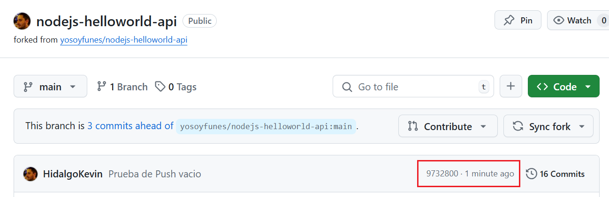

# Desafio 2
Este documento sirve como guía práctica, ofreciendo un instructivo detallado para la ejecución de un pipeline en Jenkins. Se abordan tanto los procesos manuales como los automatizados, destacando cómo estos últimos permiten la ejecución continua sin intervención del usuario, desencadenada por los cambios realizados por los desarrolladores. El objetivo es proporcionar una comprensión integral de ambos enfoques, subrayando la eficiencia y la automatización en entornos DevOps.

- **Importante**: Se cuenta con el archivo adicional **Instructivo - Creacion y Configuracion Pipeline.pdf** en el mismo repositorio que ofrece informacion de los pasos a seguir para lograr hacer el pipeline del Desafio.

### Diferencias y Ventajas entre un Script Pipeline y un Pipeline Script from SCM.

| Caracteristica        | Script Pipeline | Pipeline Script from SCM  | 
|-------------|--------|------------------------|
| Fuente de Definicion | Definido directamente en el Jenkins como script | Almacenado en un sistema de control de versiones como Git, vinculado a Jenkins |
| Control de versiones | Sin control de versiones directo, los cambios necesitan actualizaciones manuales | Control de versiones total a través del repositorio de origen |
| Flexibilidad | Flexibilidad limitada; los cambios requieren actualizaciones manuales en Jenkins | Altamente flexible; los cambios se pueden gestionar a través de confirmaciones de Git |
| Activación | Activada manualmente o mediante trabajos cron simples | Activada automáticamente por cambios en el SCM (por ejemplo, webhook de GitHub) |
| Colaboración | Es más difícil colaborar; los cambios están localizados en Jenkins. | Colaboración más sencilla; todos los miembros del equipo pueden contribuir a través de Git |
| Capacidad de reversión | Se requiere intervención manual para la reversión | Reversión simple a través de Git revert o cambio de rama |
| Tiempo de configuración | Rápido de configurar para proyectos pequeños, pero complejo de mantener para proyectos grandes. | Requiere configuración inicial de SCM y webhooks, pero es más fácil de mantener. |
| Escalabilidad | Menos escalable para equipos grandes o proyectos múltiples | Altamente escalable; se integra bien con los flujos de trabajo del equipo y las ramificaciones |
| Seguimiento de cambios | Difícil realizar un seguimiento de los cambios o un seguimiento de auditoría | Todos los cambios se rastrean en el SCM |
| Integración | Integración básica; limitado a lo que está configurado directamente en Jenkins. | Capacidades de integración avanzadas, aprovechando los flujos de trabajo de Git. |
 
---

# Ejecucion de un Pipeline de Jenkins
Se procedera a comentar el procedimiento para ejecutar un pipeline en jenkins tanto de forma manual y automatizada.

## Forma Manual
1. **Acceder a Jenkins**: Abre tu navegador web y accede a la URL de servidor Jenkins (en este caso la URL expuesta por Ngrok).
2. **Iniciar sesión**: Ingresa tus credenciales de usuario y contraseña para acceder al dashboard de Jenkins.
3. **Buscar el pipeline**: En el dashboard de Jenkins debes navegar por los distintos directorios con el fin de encontrar el pipeline a ejecutar, en este caso el pipeline **Desafio2** se encuentra almacenado en el directorio **Bootcamp-DevOps**.

<p align="center">
<a href="#" target="_blank" rel="noopener noreferrer">

</a>
</p>

4. **Seleccionar el pipeline**: Haz clic en el pipeline Desafio2 para abrir sus detalles.
5. **Ejecutar el pipeline manualmente**: En la vista del pipeline, busca el botón **Build Now** (Construir Ahora) en el menú de opciones a la izquierda y haz clic en él. Esto iniciará la ejecución del pipeline de forma manual.

<p align="center">
<a href="#" target="_blank" rel="noopener noreferrer">

</a>
</p>

6. **Verificar la ejecución**: Después de iniciar el pipeline, podrás visualizar las ejecuciones realizadas en el Historial de Tareas (Esquina inferior izquierda) las cuales pueden finalizar correctamente o finalizar con error.

<p align="center">
<a href="#" target="_blank" rel="noopener noreferrer">

</a>
</p>

7. **Ver el Log de Ejecucion**: Para visualizar el log de la ejecucion una vez finalizado o en ejecucion: 
- Se debe hacer clic en la ultima ejecucion realizada **#N°** que se encuentra en el Historial de Tareas (Esquina inferior izquierda).
- Presionando clic en el boton **Console log** el cual te llevara a la interfaz en donde te mostrara todos los pasos que se ejecutaron del codigo del Jenkinsfile.

<p align="center">
<a href="#" target="_blank" rel="noopener noreferrer">

</a>
</p>

**Importante**: La imagen Test 1.png que se encuentra en el repositorio, corresponde a una ejecucion manual.

---

## Forma Automatizada
Para que se ejecute un pipeline de forma automatizada (sin intervencion manual en jenkins), simularemos ser un desarrollador el cual aplicara un cambio (o simular uno) en el repositorio de github el cual dispara la ejecucion del pipeline en Jenkins. 
Los pasos a realizar son:

1. **Descargar Repositorio**: El desarrollador debe descargarse el repositorio de Github en su PC local utilizando el comando git clone <url del repositorio>, en este caso seria: 
```bash
git clone https://github.com/HidalgoKevin/nodejs-helloworld-api.git
```
- **Importante**: Para ejecutar este comando de Git, debe tener instalado git en su PC local para que tome los comandos correspondientes.

2. **Realizar un cambio o commit**: Una vez clonado el repositorio en tu pc local, para que se ejecute el pipeline de forma automatica, se tiene que aplicar un cambio (o simular uno) al codigo del repositorio.
En este caso haremos un commit vacio (simulando un cambio) al repositorio con el comando:
```bash
git commit --allow-empty -m "Prueba de push vacio"
```

<p align="center">
<a href="#" target="_blank" rel="noopener noreferrer">

</a>
</p>

3. **Pushear el cambio o commit**: Una vez ejecutado, utilizaremos un push para llevar ese commit al repositorio:
```bash
git push
```

<p align="center">
<a href="#" target="_blank" rel="noopener noreferrer">

</a>
</p>

4. **Verificar Push en el Repositorio**: Se debe acceder al repositorio de Github
  - 1. **Accede a GitHub**: Abre tu navegador web y dirígete a la página principal de GitHub. 
  > https://github.com/ 
  - 2. **Iniciar Sesión**: Ingresa tus credenciales de usuario y contraseña para acceder a tu cuenta de GitHub.
  - 3. **Accede al Repositorio**: Busca el repositorio en tu lista de repositorios creados, una vez ingresado podras visualizar cual es hace cuanto fue el ultimo push realizado.

<p align="center">
<a href="#" target="_blank" rel="noopener noreferrer">

</a>
</p>

5. **Verificar Ejecucion Automatica**: Para verificar la ejecucion automatica, se debe realizar los siguientes pasos:
- Se debe acceder a Jenkins e ir al directorio en donde se encuentra el Pipeline y acceder a el.
Si no esta logueado en Jenkins, seguir los siguientes pasos:
  1. **Acceder a Jenkins**: Abre tu navegador web y accede a la URL de servidor Jenkins (en este caso la URL expuesta por Ngrok).
  2. **Iniciar sesión**: Ingresa tus credenciales de usuario y contraseña para acceder al dashboard de Jenkins.
  3. **Buscar el pipeline**: En el dashboard de Jenkins debes navegar por los distintos directorios con el fin de encontrar el pipeline a ejecutar, en este caso el pipeline Desafio2 se encuentra almacenado en el directorio Bootcamp-DevOps.
  4. **Seleccionar el pipeline**: Haz clic en el pipeline Desafio2 para abrir sus detalles.
6. **Ver el Log de Ejecucion**: Para visualizar el log de la ejecucion una vez finalizado o en ejecucion: 
- Se debe hacer clic en la ultima ejecucion realizada **#N°** que se encuentra en el Historial de Tareas en la Esquina inferior izquierda.
- Presionando clic en el boton **Console log** el cual te llevara a la interfaz en donde te mostrara todos los pasos que se ejecutaron del codigo del Jenkinsfile.

Estos pasos te permitirán ejecutar y supervisar un pipeline en Jenkins (en este caso Desafio2), tanto manualmente como de manera automatizada según tus necesidades.

**Importante**: La imagen Test 2.png que se encuentra en el repositorio, corresponde a una ejecucion automatizada generada por un push externo.

---