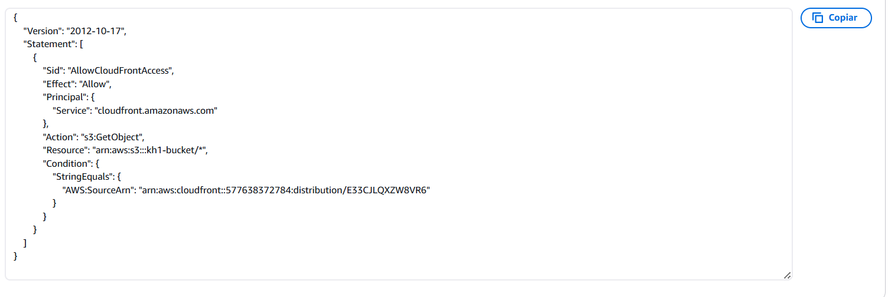

# Desafio 7

## Descripción
El objetivo principal es diseñar e implementar una infraestructura en AWS para servir contenido estático de manera eficiente, segura y global utilizando las mejores prácticas de Infraestructura como Código (IaC) con Terraform. Para ello, se integra con Amazon CloudFront, el cual optimiza la distribución del contenido al reducir la latencia y proporcionar acceso global seguro.

## Descarga del proyecto

Se debe descargar el proyecto y acceder a la carpeta del desafio.
```bash
https://github.com/HidalgoKevin/Bootcamp-DevOpsEngineer.git

cd Bootcamp-DevOpsEngineer/Desafio_7
```

## Requisitos previos a aplicar

Se debe tener instalado terraform para poder avanzar con la implementacion de la arquitectura en AWS.
```bash
https://developer.hashicorp.com/terraform/install
```

## Configuracion del entorno

Se debera setear como una variable de entorno las credenciales del usuario a utilizar (en este caso uno correspondiente a AWS) en la terminal que se vaya a utilizar para aplicar la arquitectura (dichas variables de entorno solo existiran en esa terminal).

```bash
#Linux
export AWS_ACCESS_KEY_ID=""
export AWS_SECRET_ACCESS_KEY=""
export AWS_SESSION_TOKEN=""
```
```bash
# windows
$env:AWS_ACCESS_KEY_ID=""
$env:AWS_SECRET_ACCESS_KEY=""
$env:AWS_SESSION_TOKEN=""
```

El usuario fue creado por SSO en AWS al cual se le asigno el permiso de **Administrador** y de **Solo lectura**, y las credenciales se obtiene accediendo con dicho usuario desde la URL creada en SSO.

## Aplicar la arquitectura

Se debe ejecutar el siguiente comando el cual procedera a descargar y establecer conexion con el proveedor configurado utilizando las credenciales seteadas como variables de entorno.

```bash
terraform init
```

<p align="center">
<a href="#" target="_blank" rel="noopener noreferrer">

</a>
</p>

Despues se ejecutara el siguiente comando que validara el manifiesto de terraform, si no posee errores te dara una lista de los componentes que se van a crear con sus configuraciones.

```bash
terraform plan
```

Se adjunta una screen que es parte de todo la arquitectura a deployar.

<p align="center">
<a href="#" target="_blank" rel="noopener noreferrer">

</a>
</p>

Una vez validado y corregido cualquier configuracion de los componentes a deployar se debera realizar el siguiente comando para aplicar los cambios.

```bash
terraform apply
```

El mismo volvera a dar la lista de componentes que se dio en el comando anterior y pedira una confirmacion "yes" para avanzar con el deployment.

una vez confirmado con "yes" se visualizara de esta forma los componentes que se estan creando:

<p align="center">
<a href="#" target="_blank" rel="noopener noreferrer">

</a>
</p>

Se puede acceder AWS y validar la creacion de los mismos.


En este caso se creo un bucket de S3 cerrado llamado **kh1-bucket** y se subio el archivo **index.html** el cual a travez de una politica creada en el bucket solo sera accesible desde CloudFront.

- Bucket + Archivo index.html

<p align="center">
<a href="#" target="_blank" rel="noopener noreferrer">

</a>
</p>

- Bucket Cerrado y Policy.

<p align="center">
<a href="#" target="_blank" rel="noopener noreferrer">


</a>

Se creo una distribucion de CloudFront la cual esta vinculada al bucket de S3 y al tener la policy configurada permitira visualizar el contenido del index.html desde la URL del CloudFront.

-  Distribucion de CloudFront

<p align="center">
<a href="#" target="_blank" rel="noopener noreferrer">

</a>
</p>

Se creo una OAC (Origin Access Control) la cual cumple la funcion de permitir controlar el acceso a los depósitos de Amazon S3 el cual se encuentra en la configuración de la distribución de CloudFront. 

<p align="center">
<a href="#" target="_blank" rel="noopener noreferrer">

</a>
</p>

Al utilizar la URL de CloudFront se puede ver el contenido de Index.html

<p align="center">

</a>
</p>