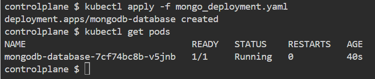

<p align="center">
  <a href="http://nestjs.com/" target="blank"></a>
</p>

[circleci-image]: https://img.shields.io/circleci/build/github/nestjs/nest/master?token=abc123def456
[circleci-url]: https://circleci.com/gh/nestjs/nest

  <p align="center">A progressive <a href="http://nodejs.org" target="_blank">Node.js</a> framework for building efficient and scalable server-side applications.</p>
    <p align="center">
<a href="https://www.npmjs.com/~nestjscore" target="_blank"></a>
<a href="https://www.npmjs.com/~nestjscore" target="_blank"></a>
<a href="https://www.npmjs.com/~nestjscore" target="_blank"></a>
<a href="https://circleci.com/gh/nestjs/nest" target="_blank"></a>
<a href="https://coveralls.io/github/nestjs/nest?branch=master" target="_blank"></a>
<a href="https://discord.gg/G7Qnnhy" target="_blank"></a>
<a href="https://opencollective.com/nest#backer" target="_blank"></a>
<a href="https://opencollective.com/nest#sponsor" target="_blank"></a>
  <a href="https://paypal.me/kamilmysliwiec" target="_blank"></a>
    <a href="https://opencollective.com/nest#sponsor"  target="_blank"></a>
  <a href="https://twitter.com/nestframework" target="_blank"></a>
</p>
  <!--[](https://opencollective.com/nest#backer)
  [](https://opencollective.com/nest#sponsor)-->

---

## Descripción

En este desafío, vamos a crear un archivo Dockerfile para construir la aplicación NestJS y varios manifiestos de Kubernetes (Deployment, Service, ConfigMap, y PersistentVolumeClaim) para desplegar un entorno completo con Nginx (frontend), NestJS (backend) y MongoDB (base de datos). Este entorno estará diseñado para funcionar en un clúster de Kubernetes, permitiendo a los desarrolladores gestionar y escalar los servicios de forma eficiente.

## Descargar el proyecto

Se debe clonar el repositorio y acceder a la carpeta del proyecto
```bash
git clone https://github.com/HidalgoKevin/Bootcamp-DevOpsEngineer

cd Bootcamp-DevOpsEngineer/Desafio_8
```

Una vez dentro de la carpeta del proyecto (desafio), se debe acceder a la carpeta kubernetes en la cual existiran 3 carpetas las cuales tendran los manifiestos de kubernetes de cada aplicacion mencionada anteriormente.

## Ejecutar el proyecto

Para ejecutar los manifiestos y dejar habilitado la infraestructura se deben realizar utilizando el siguiente comando y los manifiestos tienen un orden en el cual se ejecutan para evitar errores.

```bash
kubectl apply -f "archivo"
```

Orden de los manifiestos:
- **Configmap**: Almacena configuraciones no sensibles en pares clave-valor.
- **Volume**: es una solicitud de almacenamiento persistente realizada por un Pod. (PersistentVolume o PersistentVolumeClaim)
- **Deployment**: Una implementación administra un conjunto de pods para ejecutar una carga de trabajo de la aplicación, normalmente una que no mantiene el estado.
- **Service**: Expone una aplicación que se ejecuta en el clúster detrás de un único punto de conexión orientado hacia el exterior.

---

### 0 - Crear Namespace y acceder a el

Con el fin de que los Pods no queden en cualquier lado por defecto, lo mas optimo seria crear un namespace para poder identificar la ubicacion de los pods ejecutados.

```bash
kubectl create namespace desafio8
```
Una vez creado, utilizaremos el comando kubens el cual nos permitira acceder en el.
Es muy posible que no este inteladado en la pc anfitrion, se instala y accede al namespace con los siguientes comandos:

```bash
snap install kubectx --classic
kubens desafio8
```

### 1 - Base de Datos:

Comenzaremos con la base de datos, se debe acceder a la carpeta mongo que se encuentra el directorio kubernetes:

```bash
cd kubertenes/mongodb
```
Despues se deben ejecutar los manifiestos en el orden anterior mencionado:

```bash
kubectl apply -f mongo_config.yaml
kubectl apply -f mongo_deployment.yaml
kubectl apply -f mongo_service.yaml
```

<p align="center">
<a href="#" target="_blank" rel="noopener noreferrer">



</a>
</p>

---

### 2 - NestJS

Se debe acceder a la carpeta nestjs que existe dentro del directorio kubernetes, como ya se encuentra en una carpeta dentro de dicho directorio solo debera retroceder un directorio con el comando **cd ..**

```bash
cd nestjs
```

Despues se deben ejecutar los manifiestos:

```bash
kubectl apply -f nestjs_deployment.yaml
kubectl apply -f nestjs_service.yaml
```

<p align="center">
<a href="#" target="_blank" rel="noopener noreferrer">

</a>
</p>

La imagen utilizada en el nestjs_deployment.yaml fue creada especificamente para ese manifiesto ya que kubernetes siempre busca imagenes publicadas, y para utilizar imagenes locales se debe configurar el entorno lo cual son varios pasos adicionales.

```bash
https://hub.docker.com/repository/docker/khidalg1/nestjs-kh/tags
```

---

### 3 - Nginx

Se debe acceder a la carpeta nginx dentro del directorio kubernetes.

Despues se deben ejecutar los manifiestos:

```bash
kubectl apply -f nginx_config.yaml
kubectl apply -f nginx_deployment.yaml
kubectl apply -f nginx_service.yaml
```

<p align="center">
<a href="#" target="_blank" rel="noopener noreferrer">


</a>
</p>

Adicional: En el caso de querer acceder por web al pod creado, ya que al no tener un dominio disponible no usamos un Ingress, podemos habilitar el puerto para poder acceder via localhost.

```bash
kubectl port-forward pod/nombre_pod 80
```
Reemplazar **nombre_pod** por el por del nginx y una vez realizado el comando si van al navegador y colocan **http://localhost:80** deberian poder visualizar la pagina de nginx.

---

## Ejecutar Tests

Para comprobar el funcionamiento se pueden realizar los siguientes tests una vez que se accede al pod nestjs-backend.

```bash
kubectl exec -it "Name-Pod" -- /bin/bash
```
Reemplazar el **"Name-Pod"** por el correspondiente, para obtenerlo realizar un **kubectl get pods**.
Una vez accedido deberia aparecer en el directorio **/usr/src/app** y una vez ahi ejecutara los siguientes comandos correspondientes a las 3 pruebas.

```bash
# unit tests
$ npm run test
```

Resultado esperado:

<p align="center">
<a href="#" target="_blank" rel="noopener noreferrer">

</a>
</p>

```bash
# e2e tests
$ npm run test:e2e
```

Resultado esperado:

<p align="center">
<a href="#" target="_blank" rel="noopener noreferrer">

</a>
</p>

```bash
# test coverage
$ npm run test:cov
```

Resultado esperado:

<p align="center">
<a href="#" target="_blank" rel="noopener noreferrer">

</a>
</p>