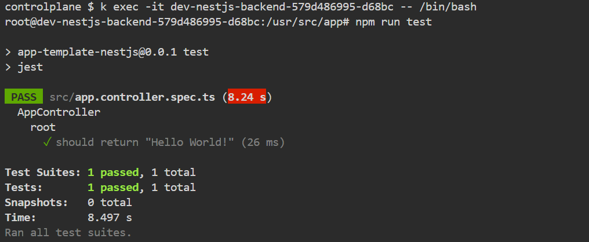
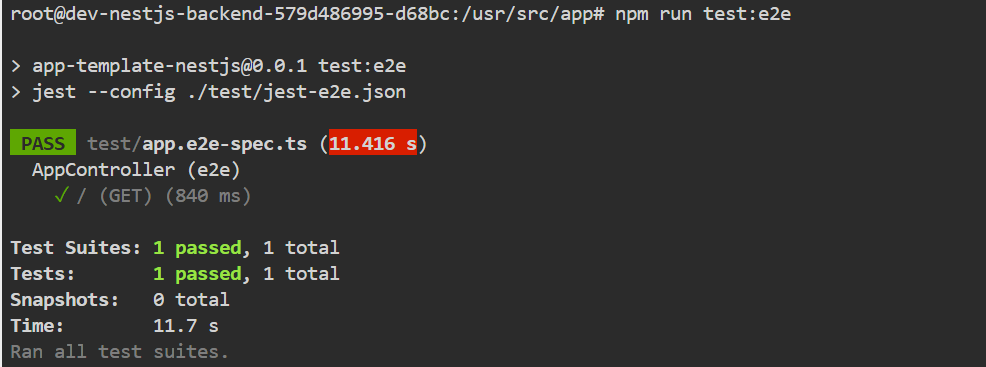
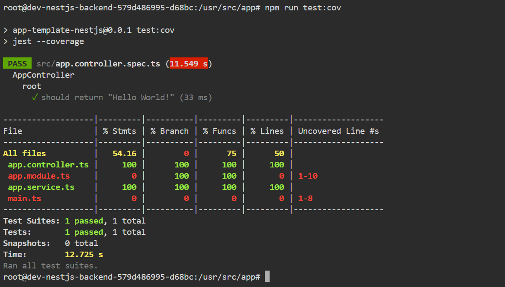

<p align="center">
  <a href="http://nestjs.com/" target="blank"></a>
</p>

[circleci-image]: https://img.shields.io/circleci/build/github/nestjs/nest/master?token=abc123def456
[circleci-url]: https://circleci.com/gh/nestjs/nest

  <p align="center">A progressive <a href="http://nodejs.org" target="_blank">Node.js</a> framework for building efficient and scalable server-side applications.</p>
    <p align="center">
<a href="https://www.npmjs.com/~nestjscore" target="_blank"></a>
<a href="https://www.npmjs.com/~nestjscore" target="_blank"></a>
<a href="https://www.npmjs.com/~nestjscore" target="_blank"></a>
<a href="https://circleci.com/gh/nestjs/nest" target="_blank"></a>
<a href="https://coveralls.io/github/nestjs/nest?branch=master" target="_blank"></a>
<a href="https://discord.gg/G7Qnnhy" target="_blank"></a>
<a href="https://opencollective.com/nest#backer" target="_blank"></a>
<a href="https://opencollective.com/nest#sponsor" target="_blank"></a>
  <a href="https://paypal.me/kamilmysliwiec" target="_blank"></a>
    <a href="https://opencollective.com/nest#sponsor"  target="_blank"></a>
  <a href="https://twitter.com/nestframework" target="_blank"></a>
</p>
  <!--[](https://opencollective.com/nest#backer)
  [](https://opencollective.com/nest#sponsor)-->

---

## Descripción

En este desafío, vamos a utilizar Helm Charts para construir y gestionar la arquitectura de la aplicación. Crearemos un Helm Chart que incluirá plantillas para los diferentes componentes de la aplicación NestJS, como el frontend con Nginx, el backend con NestJS, y la base de datos con MongoDB. El Helm Chart generará los manifiestos necesarios (Deployment, Service, ConfigMap y PersistentVolumeClaim) para desplegar un entorno completo en un clúster de Kubernetes. Esta solución permitirá a los desarrolladores gestionar, personalizar y escalar los servicios de manera eficiente y centralizada.

## Descargar el proyecto

Se debe clonar el repositorio y acceder a la carpeta del proyecto
```bash
git clone https://github.com/HidalgoKevin/Bootcamp-DevOpsEngineer

cd Bootcamp-DevOpsEngineer
```

## Ejecutar el proyecto

### Crear Namespace y acceder a el

Con el fin de que los Pods no queden en cualquier lado por defecto, lo mas optimo seria crear un namespace para poder identificar la ubicacion de los pods ejecutados.

```bash
kubectl create namespace desafio9
```
Una vez creado, utilizaremos el comando kubens el cual nos permitira acceder en el.
Es muy posible que no este intaladado en la pc anfitrion, en el caso de no tenerlo, se instala y accede al namespace con los siguientes comandos:

```bash
snap install kubectx --classic

kubens desafio9
```

### Ejecucion del Helm Chart:

Una vez dentro de la carpeta (Bootcamp-DevOpsEngineer), se debe ejecutar el siguiente comando:

```bash
helm install dev ./Desafio_9
```

<p align="center">
<a href="#" target="_blank" rel="noopener noreferrer">

</a>
</p>

Se debe reemplazar "dev" por un valor que quieran utilizar para identificar la arquitectura desplegada.
Por ejemplo, si se utiliza el valor "dev" los objetos a crear (pods, configmap, service, etc) quedarian como "dev-nginx-frontend" o "dev-nestjs-backend".
Este valor puede servir para poder separar la arquitectura por ambientes con un valor facil de identificar.

Una vez ejecutado si se realiza el siguiente comando podran visualizar toda la arquitectura creada en el namespace "desafio9"

```bash
kubectl get all
```

<p align="center">
<a href="#" target="_blank" rel="noopener noreferrer">

</a>
</p>

---

## Ejecutar Tests

Una vez que los Pods se encuentren en estado Running (1/1), para comprobar el funcionamiento se pueden realizar los siguientes tests una vez que se accede al pod nestjs-backend.

```bash
kubectl exec -it "Name-Pod" -- /bin/bash
```
Reemplazar el **"Name-Pod"** por el correspondiente, para obtenerlo realizar un **kubectl get pods**.
Una vez accedido deberia aparecer en el directorio **/usr/src/app** y una vez ahi ejecutara los siguientes comandos correspondientes a las 3 pruebas.

```bash
# unit tests
$ npm run test
```

Resultado esperado:

<p align="center">
<a href="#" target="_blank" rel="noopener noreferrer">

</a>
</p>

```bash
# e2e tests
$ npm run test:e2e
```

Resultado esperado:

<p align="center">
<a href="#" target="_blank" rel="noopener noreferrer">

</a>
</p>

```bash
# test coverage
$ npm run test:cov
```

Resultado esperado:

<p align="center">
<a href="#" target="_blank" rel="noopener noreferrer">

</a>
</p>

---

### Nginx local

En el caso de querer acceder por web al pod creado, ya que al no tener un dominio disponible no usamos un Ingress, podemos habilitar el puerto para poder acceder via localhost.

```bash
kubectl port-forward pod/nombre_pod 80
```
Reemplazar **nombre_pod** por el del nginx y una vez realizado el comando si van al navegador y colocan **http://localhost:80** deberian poder visualizar la pagina de nginx.
